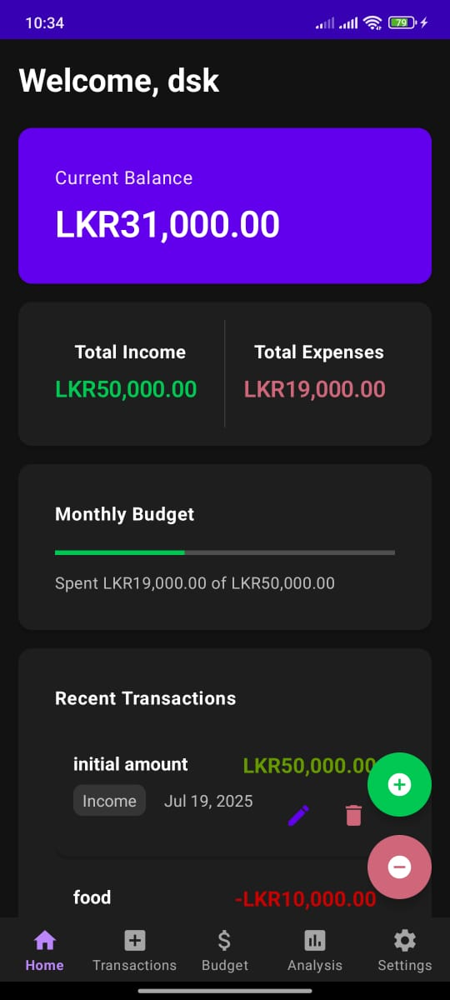
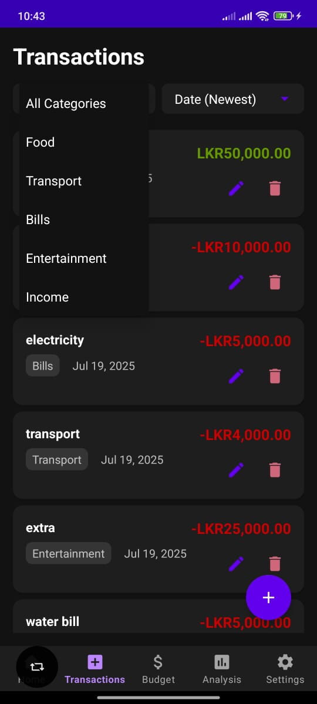
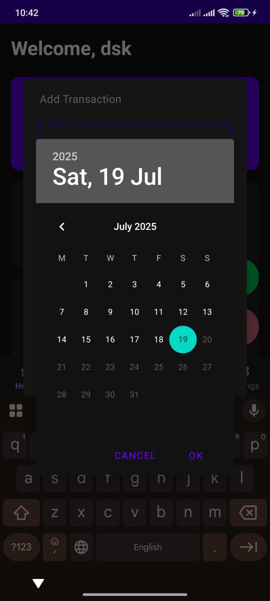
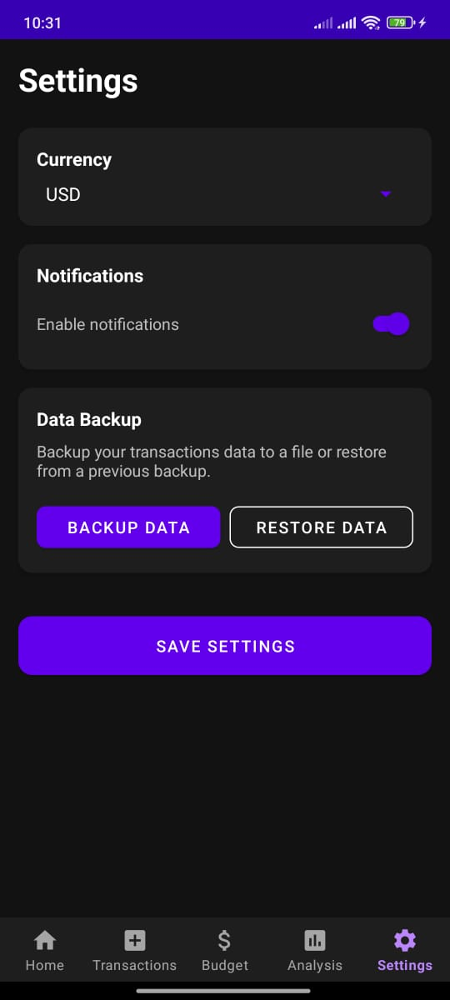

# CoinSage - Personal Finance Tracker

CoinSage is a modern Android application that helps users track their income, expenses, and savings. The app features a clean, intuitive interface and secure local data storage.

## Features

- **User Authentication**: Secure login and registration system with local storage
- **Dashboard**: Overview of current balance, budget progress, and recent transactions
- **Transaction Management**: Add, edit, and delete income and expense transactions
- **Budget Tracking**: Set monthly budgets and monitor spending progress
- **Category-based Analysis**: View spending patterns by category
- **Data Backup**: Export and import transaction data
- **Multiple Currency Support**: Track finances in your preferred currency

## Screenshots










## Technical Details

### Architecture & Libraries

- **Language**: Kotlin
- **Minimum SDK**: API 21 (Android 5.0)
- **Architecture**: MVVM with ViewBinding
- **Data Storage**: SharedPreferences for user data and transactions
- **UI Components**: Material Design 3 components
- **Charts**: MPAndroidChart for financial analysis

### Dependencies

```gradle
implementation 'androidx.core:core-ktx:1.12.0'
implementation 'androidx.appcompat:appcompat:1.6.1'
implementation 'com.google.android.material:material:1.11.0'
implementation 'androidx.constraintlayout:constraintlayout:2.1.4'
implementation 'androidx.navigation:navigation-fragment-ktx:2.7.7'
implementation 'androidx.navigation:navigation-ui-ktx:2.7.7'
implementation 'com.github.PhilJay:MPAndroidChart:v3.1.0'
implementation 'androidx.lifecycle:lifecycle-viewmodel-ktx:2.7.0'
implementation 'androidx.lifecycle:lifecycle-livedata-ktx:2.7.0'
implementation 'com.google.code.gson:gson:2.10.1'
implementation 'androidx.work:work-runtime-ktx:2.9.0'
```

## Setup Instructions

1. Clone the repository:
   ```bash
   git clone https://github.com/yourusername/CoinSage.git
   ```

2. Open the project in Android Studio

3. Sync project with Gradle files

4. Run the app on an emulator or physical device

## Contributing

1. Fork the repository
2. Create a feature branch
3. Commit your changes
4. Push to the branch
5. Create a Pull Request

## License

This project is licensed under the MIT License - see the [LICENSE](LICENSE) file for details.

## Acknowledgments

- Material Design Icons
- MPAndroidChart library
- Android Jetpack libraries 